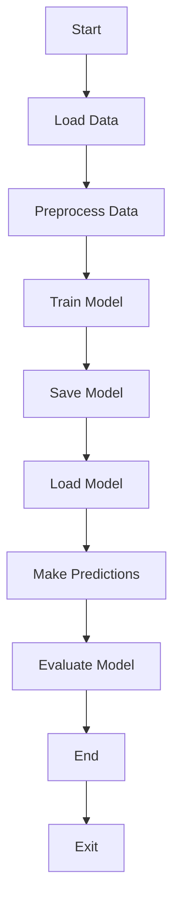

```mermaid
graph TD
    A[Start] --> B[Load Data]
    B --> C[Preprocess Data]
    C --> D[Train Model]
    D --> E[Save Model]
    E --> F[Load Model]
    F --> G[Make Predictions]
    G --> H[Evaluate Model]
    H --> I[End]
    I --> J[Exit]
```